# Object-Oriented Programming (OOP) Concepts

## Table of Contents
1. [What is OOP?](#what-is-oop)
2. [Why OOP?](#why-oop)
3. [Classes and Objects](#classes-and-objects)
4. [The 4 Pillars of OOP](#the-4-pillars-of-oop)
   - [Encapsulation](#1-encapsulation)
   - [Abstraction](#2-abstraction)
   - [Inheritance](#3-inheritance)
   - [Polymorphism](#4-polymorphism)
5. [Access Modifiers](#access-modifiers)
6. [Static vs Instance Members](#static-vs-instance-members)
7. [Interfaces](#interfaces)
8. [Abstract Classes](#abstract-classes)
9. [Composition vs Inheritance](#composition-vs-inheritance)
10. [Key Takeaways](#key-takeaways)

---

## What is OOP?

Object-Oriented Programming is a programming paradigm that organizes code around **objects** rather than functions and logic.

Think of it this way:
- **Procedural Programming:** A recipe with step-by-step instructions
- **OOP:** A kitchen with different tools (objects), each knowing how to do specific things

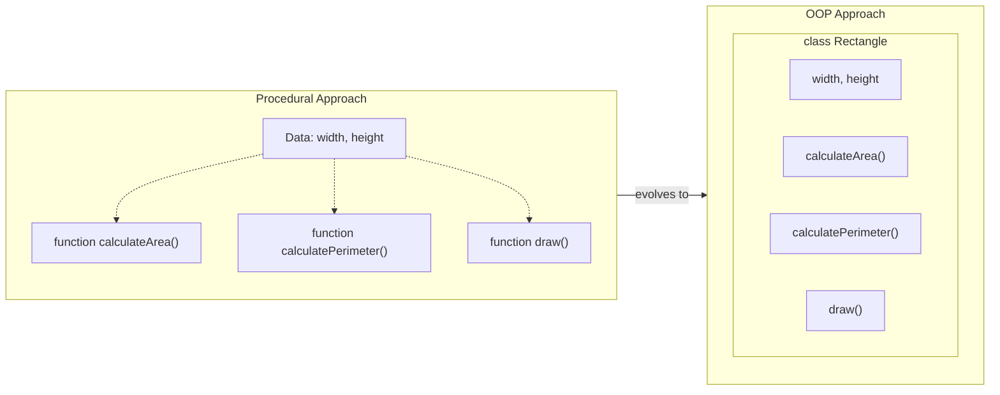

---

## Why OOP?

| Benefit | Explanation |
|---------|-------------|
| **Modularity** | Code is organized into self-contained objects |
| **Reusability** | Objects can be reused across different parts of the application |
| **Maintainability** | Changes in one object don't affect others |
| **Scalability** | Easy to add new features by adding new objects |
| **Real-world modeling** | Objects represent real-world entities naturally |

---

## Classes and Objects

### What is a Class?

A **class** is a blueprint or template that defines:
- What data (properties) an object will have
- What actions (methods) an object can perform

### What is an Object?

An **object** is an instance of a class - a concrete entity created from the blueprint.

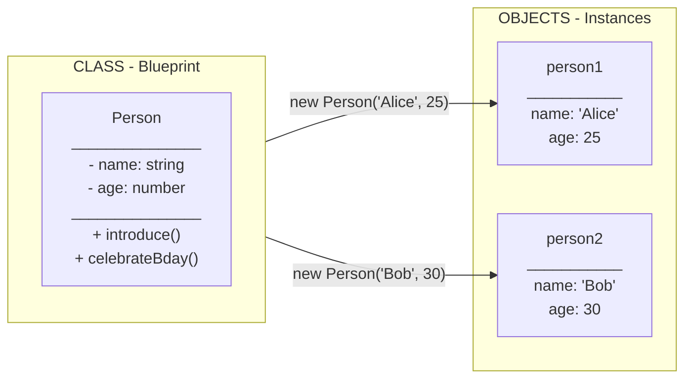

### Anatomy of a Class

```typescript
class Person {
  // PROPERTIES (State/Data)
  // What the object "has"
  name: string;
  age: number;

  // CONSTRUCTOR
  // Called when creating new object
  // Initializes the object's state
  constructor(name: string, age: number) {
    this.name = name;  // 'this' refers to current instance
    this.age = age;
  }

  // METHODS (Behavior/Actions)
  // What the object "can do"
  introduce(): string {
    return `Hi, I'm ${this.name}`;
  }

  celebrateBirthday(): void {
    this.age++;
    console.log(`Happy Birthday! Now ${this.age} years old`);
  }
}

// Creating objects
const alice = new Person("Alice", 25);  // new keyword creates object
const bob = new Person("Bob", 30);
```

### The `this` Keyword

`this` refers to the current instance of the class. It's how an object refers to itself.

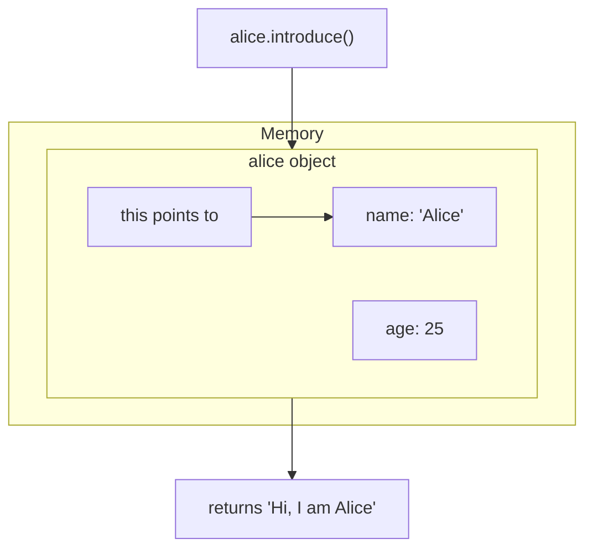

When `alice.introduce()` is called, `this.name` refers to Alice's name property.

---

## The 4 Pillars of OOP

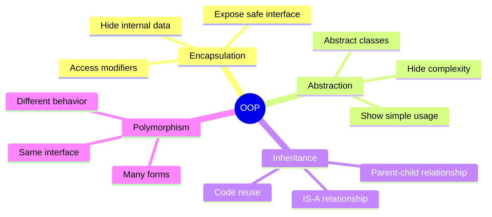

---

### 1. ENCAPSULATION

**Definition:** Bundling data (properties) and methods that operate on that data within a single unit (class), and controlling access to that data.

#### The Problem Without Encapsulation

```typescript
// BAD: No encapsulation - anyone can mess with the data
class BankAccountBad {
  balance: number = 0;
}

const account = new BankAccountBad();
account.balance = -1000000;  // Invalid state allowed
```

#### The Solution With Encapsulation

```typescript
// GOOD: Encapsulated - data is protected
class BankAccount {
  private balance: number = 0;  // Private - hidden from outside

  deposit(amount: number): void {
    if (amount > 0) {           // Validation before modifying
      this.balance += amount;
    }
  }

  withdraw(amount: number): boolean {
    if (amount > 0 && amount <= this.balance) {
      this.balance -= amount;
      return true;
    }
    return false;               // Prevents invalid state
  }

  getBalance(): number {
    return this.balance;        // Controlled read access
  }
}
```

#### Visual: Encapsulation as a Capsule

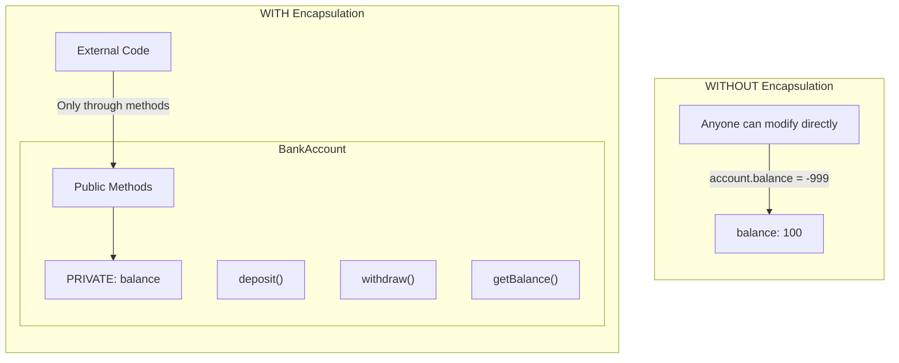

#### Real-World Analogy

Think of a **car's accelerator pedal**:
- You press the pedal (public interface)
- The complex fuel injection, engine mechanics are hidden (private implementation)
- You cannot directly manipulate fuel flow - you use the pedal

#### Key Benefits
1. **Data Protection:** Invalid data cannot be set directly
2. **Flexibility:** Internal implementation can change without affecting users
3. **Debugging:** Changes only happen through defined methods

---

### 2. ABSTRACTION

**Definition:** Hiding complex implementation details and exposing only the necessary/relevant features to the user.

#### Abstraction vs Encapsulation

| Aspect | Encapsulation | Abstraction |
|--------|---------------|-------------|
| Focus | "HOW do we hide data?" | "WHAT do we show?" |
| Hides | DATA | COMPLEXITY |
| Achieved by | Access modifiers (private, protected) | Abstract classes/interfaces |
| Level | Implementation technique | Design concept |

#### Example: Email Service

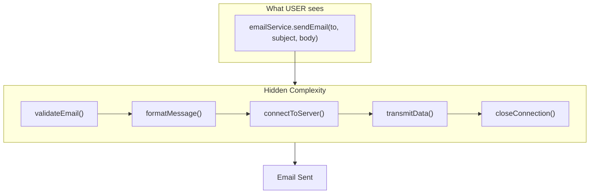

```typescript
// User sees only this simple interface
class EmailService {
  sendEmail(to: string, subject: string, body: string): boolean {
    // All complexity hidden inside
    const validated = this.validateEmail(to);
    const formatted = this.formatMessage(subject, body);
    const connected = this.connectToServer();
    const sent = this.transmitData(formatted);
    this.closeConnection();
    return sent;
  }

  // Complex private methods - user does not need to know these exist
  private validateEmail(email: string): boolean { /* ... */ return true; }
  private formatMessage(subject: string, body: string): string { /* ... */ return ""; }
  private connectToServer(): boolean { /* ... */ return true; }
  private transmitData(data: string): boolean { /* ... */ return true; }
  private closeConnection(): void { /* ... */ }
}

// Usage - beautifully simple
const email = new EmailService();
email.sendEmail("user@example.com", "Hello", "Welcome!");
// User does not care HOW it works, just THAT it works
```

#### Real-World Analogy

**TV Remote Control:**
- You press "Volume Up" button
- You do not know (or care) about: infrared signals, circuit boards, TV receiver processing
- The complexity is **abstracted** away

---

### 3. INHERITANCE

**Definition:** A mechanism where a new class (child/subclass) acquires the properties and behaviors of an existing class (parent/superclass).

#### Visual: Inheritance Hierarchy

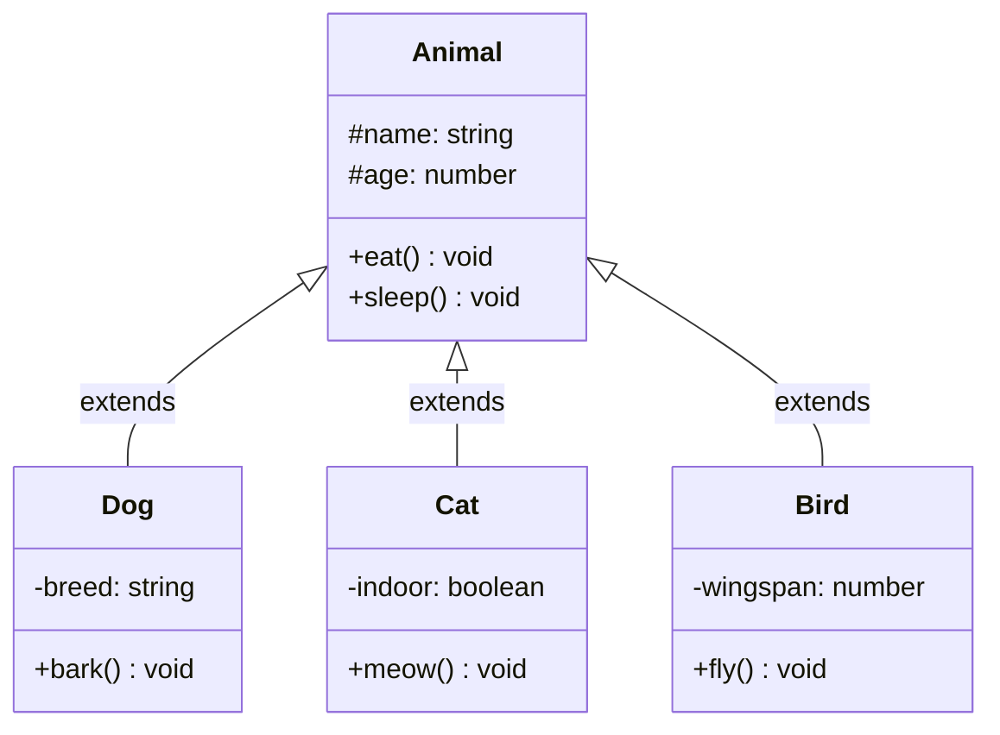

Child classes inherit `name`, `age`, `eat()`, `sleep()` from Animal AND add their own unique properties/methods.

#### Code Example

```typescript
// Parent class
class Animal {
  constructor(
    protected name: string,    // protected = accessible in child classes
    protected age: number
  ) {}

  eat(): void {
    console.log(`${this.name} is eating`);
  }

  sleep(): void {
    console.log(`${this.name} is sleeping`);
  }
}

// Child class - inherits from Animal
class Dog extends Animal {
  private breed: string;

  constructor(name: string, age: number, breed: string) {
    super(name, age);    // Call parent constructor FIRST
    this.breed = breed;  // Then initialize own properties
  }

  // Own method
  bark(): void {
    console.log(`${this.name} says: Woof!`);
  }

  // Override parent method (Polymorphism!)
  eat(): void {
    console.log(`${this.name} is eating dog food`);
  }
}

// Usage
const buddy = new Dog("Buddy", 3, "Golden Retriever");
buddy.eat();    // "Buddy is eating dog food" (overridden)
buddy.sleep();  // "Buddy is sleeping" (inherited)
buddy.bark();   // "Buddy says: Woof!" (own method)
```

#### The `super` Keyword

`super` is used to:

1. **Call parent constructor** (must be first line in child constructor)
```typescript
constructor(name: string) {
  super(name);  // Calls parent constructor
}
```

2. **Call parent methods**
```typescript
eat(): void {
  super.eat();  // Calls Animal's eat()
  console.log("...and some treats!");
}
```

#### Types of Inheritance

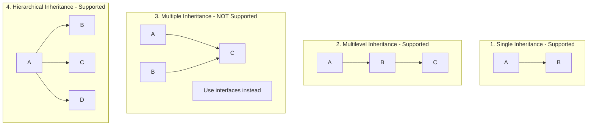

#### When to Use Inheritance

**USE when:**
- There is a clear "IS-A" relationship (Dog IS-A Animal)
- Child classes share significant behavior with parent
- You want to leverage polymorphism

**AVOID when:**
- Relationship is "HAS-A" (Car HAS-A Engine) - Use Composition instead
- Just to reuse code (might lead to tight coupling)
- Inheritance hierarchy becomes too deep (more than 3 levels)

---

### 4. POLYMORPHISM

**Definition:** The ability of objects of different classes to respond to the same method call in different ways. "Many forms" - same interface, different implementations.

#### Types of Polymorphism

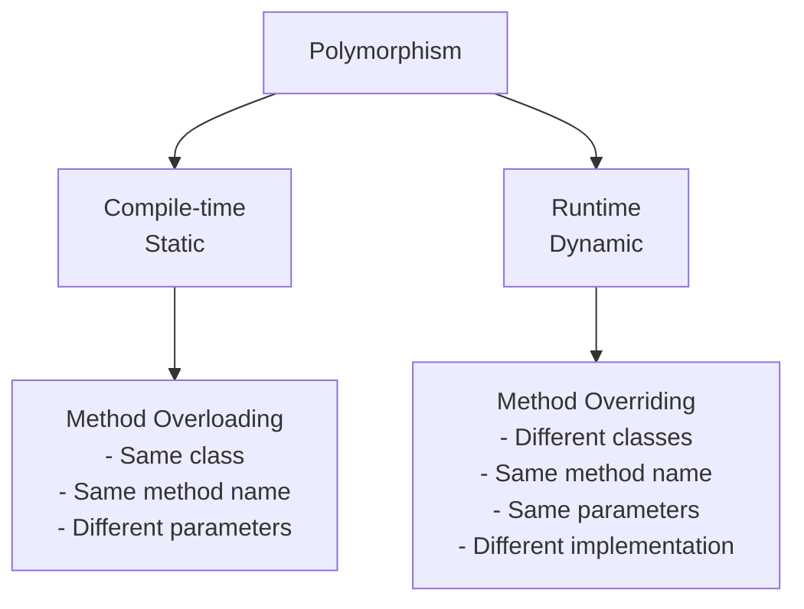

#### Runtime Polymorphism Example

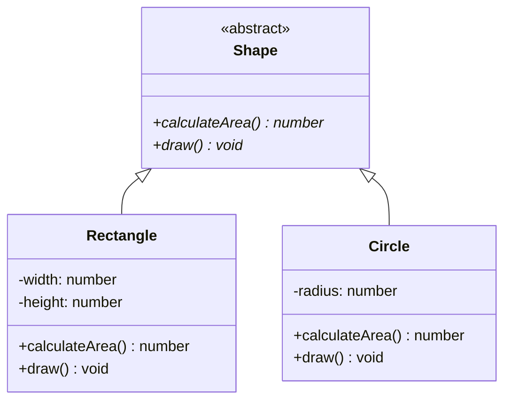

```typescript
abstract class Shape {
  abstract calculateArea(): number;
  abstract draw(): void;
}

class Rectangle extends Shape {
  constructor(private width: number, private height: number) {
    super();
  }

  calculateArea(): number {
    return this.width * this.height;
  }

  draw(): void {
    console.log(`Drawing rectangle ${this.width}x${this.height}`);
  }
}

class Circle extends Shape {
  constructor(private radius: number) {
    super();
  }

  calculateArea(): number {
    return Math.PI * this.radius ** 2;
  }

  draw(): void {
    console.log(`Drawing circle with radius ${this.radius}`);
  }
}

// POLYMORPHISM IN ACTION
const shapes: Shape[] = [
  new Rectangle(10, 5),
  new Circle(7),
  new Rectangle(3, 4)
];

// Same method call, different behavior based on actual type
for (const shape of shapes) {
  shape.draw();           // Each shape draws differently
  console.log(`Area: ${shape.calculateArea()}`);
}
```

#### Visual: Polymorphism Flow

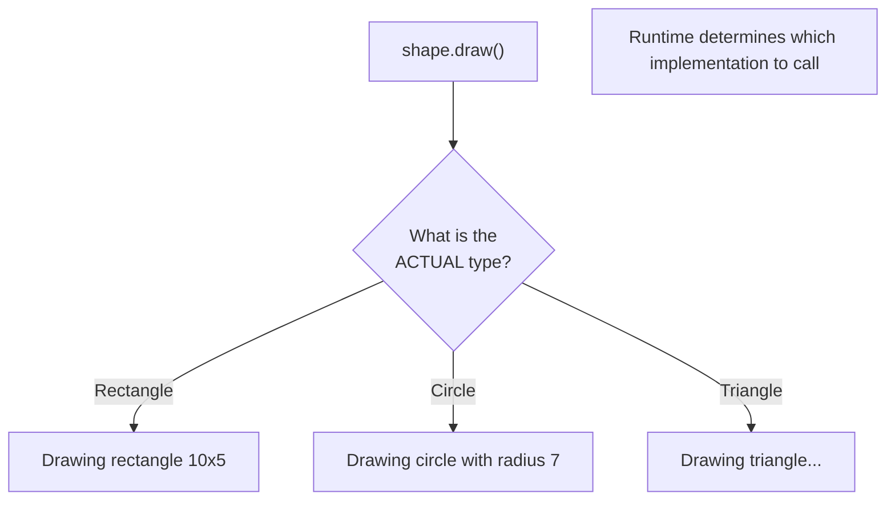

#### Why Polymorphism is Powerful

```typescript
// WITHOUT polymorphism - messy code
function processShapeBad(shape: any) {
  if (shape.type === "rectangle") {
    return shape.width * shape.height;
  } else if (shape.type === "circle") {
    return Math.PI * shape.radius ** 2;
  } else if (shape.type === "triangle") {
    // Keep adding more if-else...
  }
}

// WITH polymorphism - clean, extensible code
function processShape(shape: Shape): number {
  return shape.calculateArea();  // Works for ANY shape!
}

// Adding new shapes does not require changing processShape()
class Triangle extends Shape {
  calculateArea(): number { /* ... */ return 0; }
  draw(): void { /* ... */ }
}
// processShape(new Triangle()) just works!
```

---

## Access Modifiers

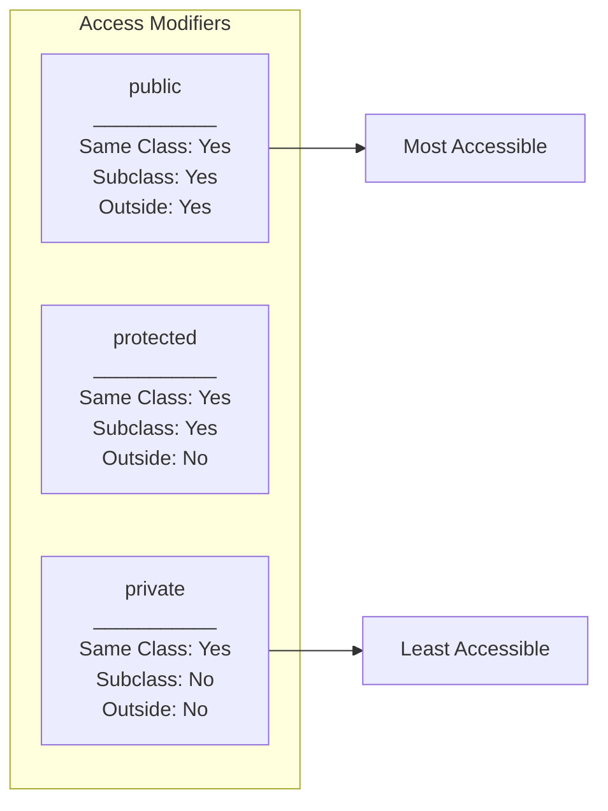

```typescript
class Parent {
  public publicProp = 1;       // Anywhere
  protected protectedProp = 2; // This class + children
  private privateProp = 3;     // Only this class
}

class Child extends Parent {
  test() {
    this.publicProp;     // OK
    this.protectedProp;  // OK
    this.privateProp;    // Error!
  }
}

const obj = new Parent();
obj.publicProp;          // OK
obj.protectedProp;       // Error!
obj.privateProp;         // Error!
```

---

## Static vs Instance Members

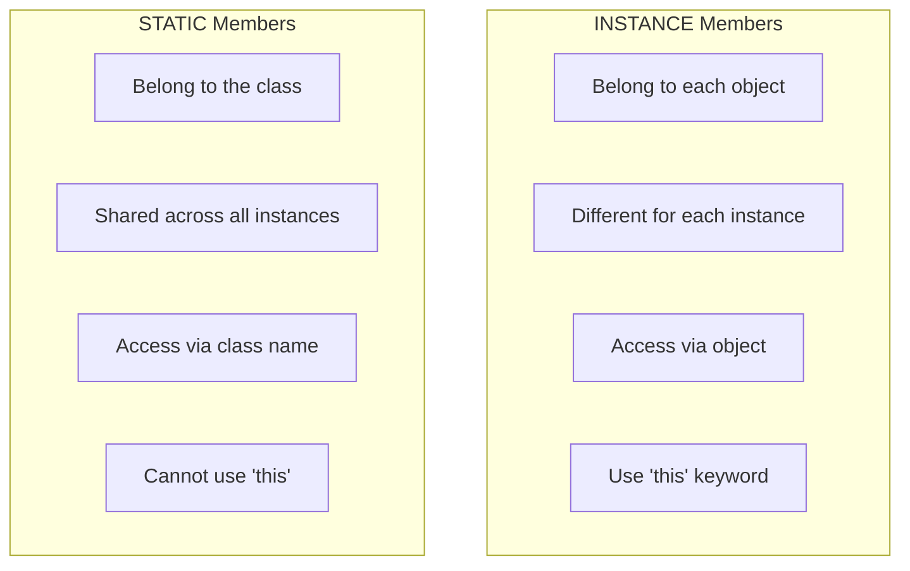

```typescript
class Counter {
  static totalCount = 0;     // Shared by all instances
  instanceId: number;        // Unique per object

  constructor() {
    Counter.totalCount++;
    this.instanceId = Counter.totalCount;
  }

  static getTotal(): number {  // Called on class
    return Counter.totalCount;
  }
}

const a = new Counter();  // instanceId: 1, totalCount: 1
const b = new Counter();  // instanceId: 2, totalCount: 2
const c = new Counter();  // instanceId: 3, totalCount: 3

Counter.getTotal();  // 3 (called on class, not object)
```

---

## Interfaces

An **interface** defines a contract - what methods/properties a class MUST have.

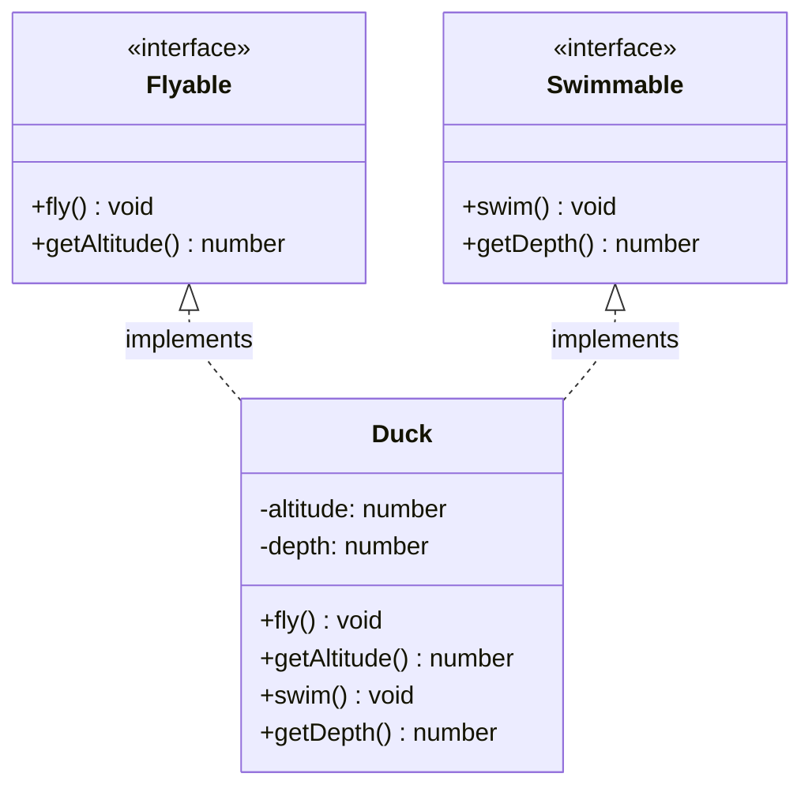

```typescript
// Interface = Contract
interface Flyable {
  fly(): void;
  getAltitude(): number;
}

interface Swimmable {
  swim(): void;
  getDepth(): number;
}

// Class implementing multiple interfaces
class Duck implements Flyable, Swimmable {
  private altitude = 0;
  private depth = 0;

  fly(): void {
    this.altitude = 100;
    console.log("Duck is flying!");
  }

  getAltitude(): number {
    return this.altitude;
  }

  swim(): void {
    this.depth = 5;
    console.log("Duck is swimming!");
  }

  getDepth(): number {
    return this.depth;
  }
}
```

A class can implement **MULTIPLE** interfaces (unlike inheritance, which is single in TypeScript).

---

## Abstract Classes

An **abstract class** cannot be instantiated directly. It is a partial implementation that child classes must complete.

| Aspect | Interface | Abstract Class |
|--------|-----------|----------------|
| Methods | Only signatures | Can have implementations |
| Constructor | No | Yes |
| Access modifiers | All public | Can have private/protected |
| Multiple | Yes (multiple implementation) | No (single inheritance) |
| Relationship | "Can do" | "Is a" |

```typescript
abstract class Shape {
  protected color: string;

  constructor(color: string) {
    this.color = color;
  }

  // Concrete method - has implementation
  getColor(): string {
    return this.color;
  }

  // Abstract method - MUST be implemented by child
  abstract draw(): void;
  abstract calculateArea(): number;
}

class Circle extends Shape {
  constructor(color: string, private radius: number) {
    super(color);
  }

  draw(): void {
    console.log(`Drawing ${this.color} circle`);
  }

  calculateArea(): number {
    return Math.PI * this.radius ** 2;
  }
}
```

---

## Composition vs Inheritance

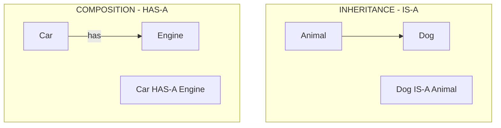

| Aspect | Inheritance | Composition |
|--------|-------------|-------------|
| Relationship | IS-A | HAS-A |
| Coupling | Tight | Loose |
| Flexibility | Less flexible | More flexible |
| Runtime changes | Not possible | Possible |
| Code reuse | Through hierarchy | Through delegation |

### Why Composition is Often Better

```typescript
// INHERITANCE - tightly coupled
class Dog extends Animal {
  // Dog is forever an Animal
  // Cannot change at runtime
}

// COMPOSITION - loosely coupled
class Car {
  private engine: Engine;

  constructor(engine: Engine) {
    this.engine = engine;  // Can inject different engines!
  }

  // Can even swap engine at runtime
  setEngine(engine: Engine): void {
    this.engine = engine;
  }

  start(): void {
    this.engine.ignite();
  }
}

// Flexibility!
const electricCar = new Car(new ElectricEngine());
const gasCar = new Car(new GasEngine());
```

**"Favor composition over inheritance"** - Design principle

---

## Key Takeaways

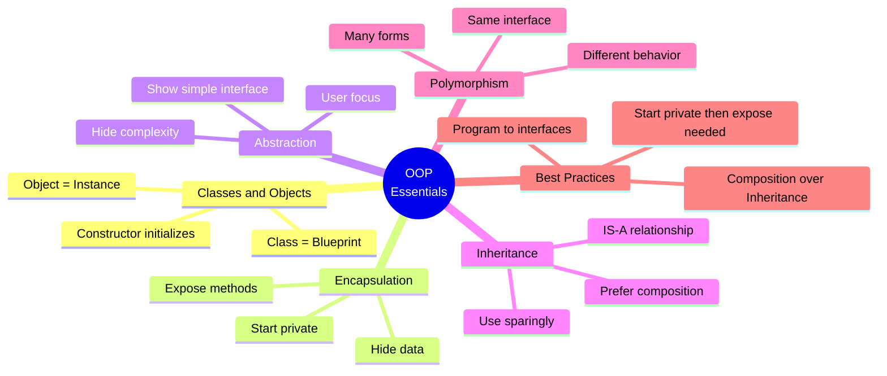

| Concept | One-Liner |
|---------|-----------|
| **Class** | Blueprint for creating objects |
| **Object** | Instance of a class with actual values |
| **Encapsulation** | Hide data, expose safe methods |
| **Abstraction** | Hide complexity, show simplicity |
| **Inheritance** | Child gets parent's stuff and adds own |
| **Polymorphism** | Same method, different behaviors |
| **Composition** | Build complex objects from simpler ones |

---

## Next Steps

- See [example.ts](./example.ts) for working code examples
- See [interview-questions.md](./interview-questions.md) for practice questions
- Move to [SOLID Principles](../02-solid-principles/README.md) after mastering OOP
