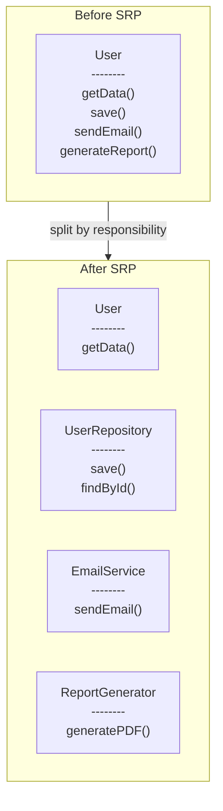
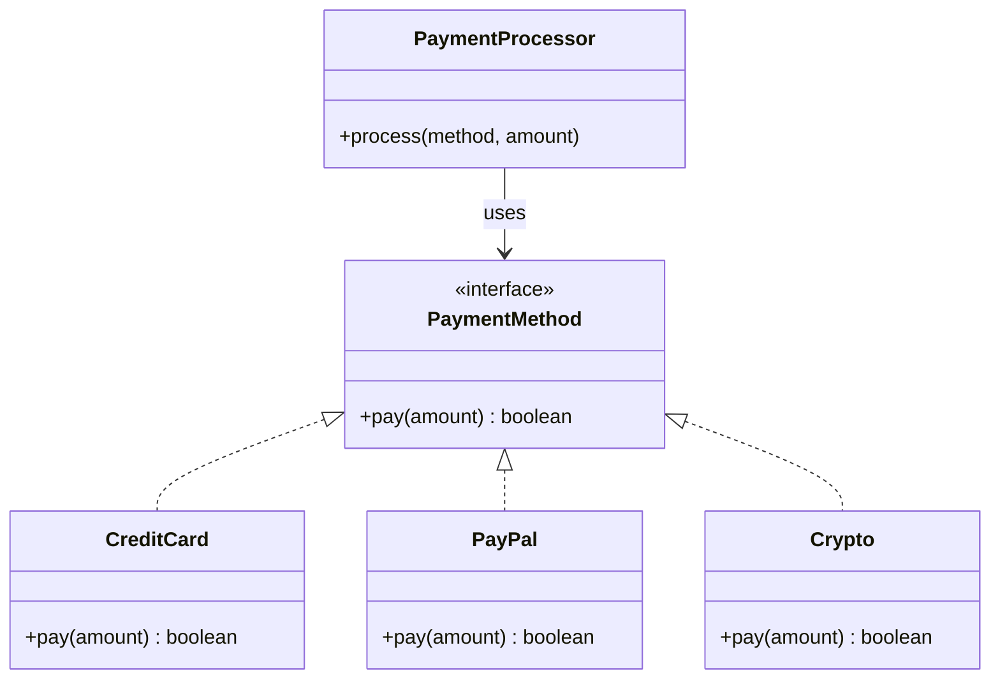
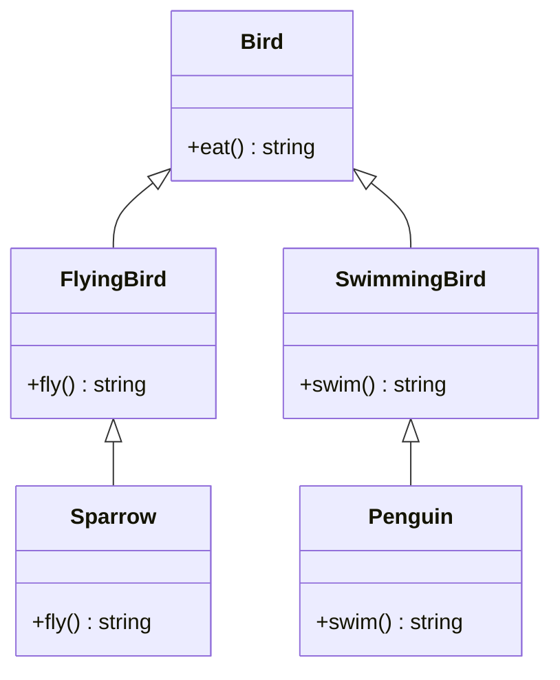
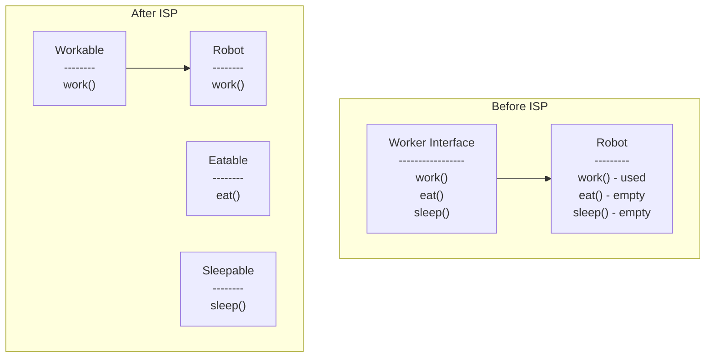
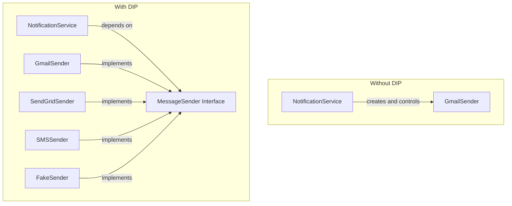
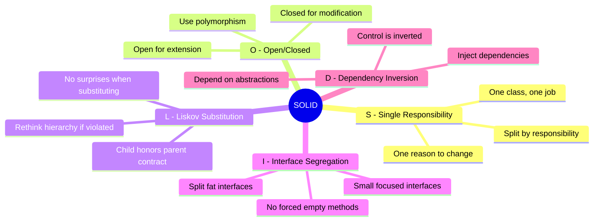

# SOLID Principles

SOLID is a set of five design principles that help you write code that is easy to maintain, extend, and test.

| Letter | Principle | One-Liner |
|--------|-----------|-----------|
| **S** | Single Responsibility | One class, one job |
| **O** | Open/Closed | Add new features without changing existing code |
| **L** | Liskov Substitution | Child must honor parent's contract |
| **I** | Interface Segregation | Don't force classes to implement useless methods |
| **D** | Dependency Inversion | Depend on interfaces, not concrete classes |

---

## Quick Difference: L vs I vs D

These three can be confusing. Here is the simple difference:

| Principle | Problem It Solves | Question to Ask |
|-----------|-------------------|-----------------|
| **L - Liskov** | Child class breaks parent's promise | "Can I replace parent with child without breaking anything?" |
| **I - Interface Segregation** | Class forced to implement methods it does not need | "Is this class implementing empty/useless methods just to satisfy an interface?" |
| **D - Dependency Inversion** | High-level class is stuck with one specific low-level class | "Is this class creating its own dependencies inside, or receiving them from outside?" |

Another way to remember:
- **L** is about **inheritance** - child must honor parent's contract
- **I** is about **interfaces** - don't make fat interfaces
- **D** is about **dependencies** - inject them, don't create them inside

---

## S - Single Responsibility Principle (SRP)

### Definition

A class should have only one reason to change.

In other words: one class does one job.

### The Problem

```typescript
class User {
  constructor(private name: string, private email: string) {}

  // Reason 1: User data changes
  getName(): string {
    return this.name;
  }

  // Reason 2: Database logic changes
  save() {
    // INSERT INTO users...
  }

  // Reason 3: Email provider changes
  sendWelcomeEmail() {
    // SMTP logic...
  }

  // Reason 4: Report format changes
  generatePDFReport() {
    // PDF generation...
  }
}
```

This class has 4 reasons to change. When email provider changes, you are editing a `User` class. That makes no sense.

### The Solution

```typescript
class User {
  constructor(public name: string, public email: string) {}
}

class UserRepository {
  save(user: User): void {
    // Database logic only
  }

  findById(id: string): User {
    // Database logic only
  }
}

class EmailService {
  sendWelcomeEmail(user: User): void {
    // Email logic only
  }
}

class UserReportGenerator {
  generatePDF(user: User): Buffer {
    // Report logic only
  }
}
```

Now each class has one job:
- `User` - holds user data
- `UserRepository` - database operations
- `EmailService` - sending emails
- `UserReportGenerator` - creating reports



### How to Identify SRP Violation

Ask yourself:
- Does this class name contain "And"? (UserAndEmailManager)
- Does this class name contain "Manager", "Handler", "Processor" with many methods?
- Are there groups of methods that do not use each other?
- When explaining what the class does, do you use the word "and" multiple times?

### Real-World Analogy

A chef cooks food. A waiter serves food. A cashier handles payment.

You do not hire one person to do all three. If cooking style changes, you retrain the chef. The waiter and cashier are not affected.

---

## O - Open/Closed Principle (OCP)

### Definition

Software entities should be open for extension but closed for modification.

You should be able to add new behavior without changing existing code.

### The Problem

```typescript
class PaymentProcessor {
  process(type: string, amount: number) {
    if (type === 'creditcard') {
      // credit card logic
    } else if (type === 'paypal') {
      // paypal logic
    } else if (type === 'crypto') {
      // crypto logic
    }
    // Every new payment method = modify this class
  }
}
```

Every new payment type requires modifying this class. Risky because:
- You might break existing logic
- Class keeps growing
- Hard to test all branches

### The Solution

```typescript
interface PaymentMethod {
  pay(amount: number): boolean;
}

class CreditCard implements PaymentMethod {
  pay(amount: number): boolean {
    // credit card logic
    return true;
  }
}

class PayPal implements PaymentMethod {
  pay(amount: number): boolean {
    // paypal logic
    return true;
  }
}

class PaymentProcessor {
  process(method: PaymentMethod, amount: number) {
    return method.pay(amount);
  }
}

// Adding new payment method - no modification to existing code
class Crypto implements PaymentMethod {
  pay(amount: number): boolean {
    // crypto logic
    return true;
  }
}
```



### How to Identify OCP Violation

Look for:
- `if-else` or `switch` statements based on type
- Methods that need modification every time a new variant is added
- Comments like `// add new type here`

### Real-World Analogy

A power strip is open/closed. You can plug in new devices (extension) without rewiring the strip (modification).

---

## L - Liskov Substitution Principle (LSP)

### Definition

If class B is a subclass of class A, you should be able to replace A with B without breaking the program.

Child classes must honor the contract established by the parent.

### The Problem

```typescript
// Parent promises: call fly(), bird will fly
class Bird {
  fly() { return "flying"; }
}

// Child breaks that promise
class Penguin extends Bird {
  fly() { throw new Error("Can't fly"); }
}

// Code that trusted the promise now crashes
function releaseBird(bird: Bird) {
  bird.fly(); // Works for Bird, crashes for Penguin
}
```

The parent `Bird` promises that `fly()` will work. The child `Penguin` breaks that promise. Any code that depends on `Bird.fly()` working will crash when given a Penguin.

### The Solution

Restructure the hierarchy to reflect actual behavior:

```typescript
class Bird {
  eat(): string {
    return "eating";
  }
}

class FlyingBird extends Bird {
  fly(): string {
    return "flying";
  }
}

class Sparrow extends FlyingBird {
  fly(): string {
    return "sparrow flying";
  }
}

class Penguin extends Bird {
  swim(): string {
    return "penguin swimming";
  }
}

// Now type system prevents mistakes
function makeBirdFly(bird: FlyingBird): string {
  return bird.fly(); // Penguin cannot be passed here
}
```



### How to Identify LSP Violation

- Child class throws exceptions for methods it cannot support
- Child class returns null/empty for methods that parent implements
- Child class has empty method implementations
- You need to check the type before calling a method

### The Question to Ask

"Can I replace every instance of the parent class with this child class without breaking anything?"

If no, you have an LSP violation.

---

## I - Interface Segregation Principle (ISP)

### Definition

No client should be forced to depend on methods it does not use.

Many small, specific interfaces are better than one large, general interface.

### The Problem

```typescript
interface Worker {
  work(): void;
  eat(): void;
  sleep(): void;
}

class Robot implements Worker {
  work() { console.log("working"); }
  eat() { /* robots don't eat */ }   // Forced to implement
  sleep() { /* robots don't sleep */ } // Forced to implement
}
```

Robot is forced to implement methods it will never use.

### The Solution

Split into focused interfaces:

```typescript
interface Workable {
  work(): void;
}

interface Eatable {
  eat(): void;
}

interface Sleepable {
  sleep(): void;
}

class Human implements Workable, Eatable, Sleepable {
  work() { console.log("working"); }
  eat() { console.log("eating"); }
  sleep() { console.log("sleeping"); }
}

class Robot implements Workable {
  work() { console.log("working"); }
  // No useless methods
}
```



### How to Identify ISP Violation

- Classes with empty method implementations
- Methods that throw "Not Supported" exceptions
- Interfaces with many methods where most implementers only use a few
- Interface name is too generic (IManager, IHandler, IProcessor)

### The Question to Ask

"Is this class implementing empty/useless methods just to satisfy an interface?"

---

## D - Dependency Inversion Principle (DIP)

### Definition

High-level modules should not depend on low-level modules. Both should depend on abstractions.

In practice: depend on interfaces, not concrete classes. Receive dependencies, do not create them.

### Without Dependency Inversion

```typescript
class NotificationService {
  private emailer = new GmailSender(); // Creates its own dependency

  notify(user: User, message: string) {
    this.emailer.send(user.email, message);
  }
}
```

**Problems:**
1. Want to use SendGrid instead of Gmail? Change this class.
2. Want to send SMS instead of email? Change this class.
3. Want to test without actually sending emails? Cannot.

The `NotificationService` **controls** what it uses. It decided "I will use Gmail".

### With Dependency Inversion

```typescript
interface MessageSender {
  send(to: string, message: string): void;
}

class NotificationService {
  constructor(private sender: MessageSender) {} // Receives dependency

  notify(user: User, message: string) {
    this.sender.send(user.email, message);
  }
}
```

Now **you control** what NotificationService uses:

```typescript
// Use Gmail
const service1 = new NotificationService(new GmailSender());

// Use SendGrid
const service2 = new NotificationService(new SendGridSender());

// Use SMS
const service3 = new NotificationService(new SMSSender());

// Use fake for testing
const testService = new NotificationService(new FakeSender());
```

### The "Inversion"

**Before:** NotificationService decides what it uses (it is in control)

**After:** Whoever creates NotificationService decides what it uses (control is inverted)

| Without DIP | With DIP |
|-------------|----------|
| NotificationService decides what database to use | Caller decides what database NotificationService uses |
| NotificationService is in control | Control is inverted to the outside |
| Hard to change, hard to test | Easy to change, easy to test |



### Real-World Analogy

**Without DIP:** A restaurant has its own farm. Want different vegetables? Rebuild the farm.

**With DIP:** A restaurant receives vegetables from suppliers. Want different vegetables? Change supplier. Restaurant does not care where vegetables come from, just that they are vegetables.

### How to Identify DIP Violation

- `new` keyword inside a class for dependencies
- Cannot test a class without hitting real database/API/filesystem
- Changing one low-level class requires changing high-level classes
- Class names appear directly in other classes instead of interfaces

### The Question to Ask

"Is this class creating its own dependencies inside, or receiving them from outside?"

---

## Summary: L vs I vs D Side by Side

| Principle | Problem | Example |
|-----------|---------|---------|
| **L - Liskov** | Child breaks parent's behavior | Penguin extends Bird but cannot fly |
| **I - Interface Segregation** | Class implements useless methods | Robot forced to implement eat() and sleep() |
| **D - Dependency Inversion** | Class stuck with specific dependency | NotificationService hardcodes GmailSender |

Remember:
- **L** is about **inheritance** - child must honor parent's contract
- **I** is about **interfaces** - don't make fat interfaces
- **D** is about **dependencies** - inject them, don't create them inside

---

## Full Summary



| Principle | Violation Sign | Fix |
|-----------|----------------|-----|
| **SRP** | Class does multiple unrelated things | Split into multiple classes |
| **OCP** | Adding feature requires modifying existing class | Use interfaces and polymorphism |
| **LSP** | Child throws exception or behaves unexpectedly | Restructure inheritance hierarchy |
| **ISP** | Class has empty method implementations | Split interface into smaller ones |
| **DIP** | Class creates its own dependencies with `new` | Inject dependencies via constructor |

---

## Next Steps

- See [example.ts](./example.ts) for complete working examples
- See [interview-questions.md](./interview-questions.md) for practice questions
- Move to [Other Principles](../03-other-principles/README.md) (DRY, KISS, YAGNI)
